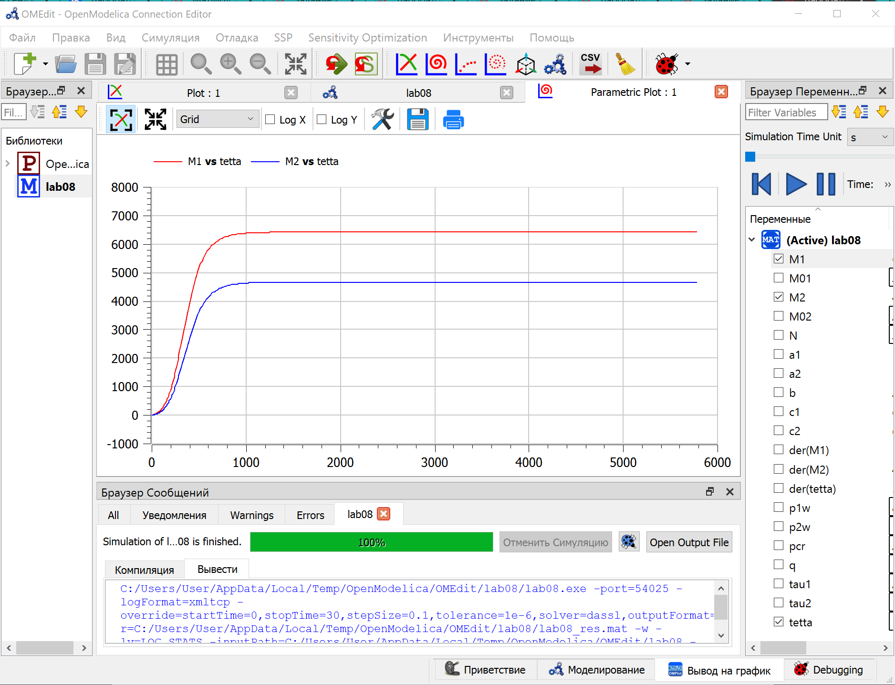
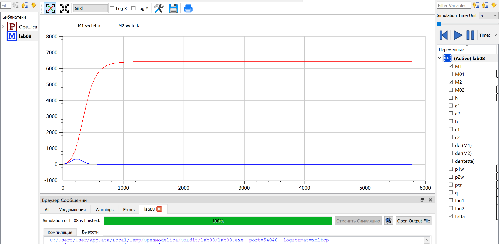

## Цель работы

1. Постройте графики изменения оборотных средств фирмы 1 и фирмы 2 без учета постоянных издержек и с введенной нормировкой для случая 1.
2. Постройте графики изменения оборотных средств фирмы 1 и фирмы 2 без учета постоянных издержек и с введенной нормировкой для случая 2. 

## Задание работы

*Случай 1.* Рассмотрим две фирмы, производящие взаимозаменяемые товары одинакового качества и находящиеся в одной рыночной нише. Считаем, что в рамках нашей модели конкурентная борьба ведётся только рыночными методами.

*Случай 2.* Рассмотрим модель, когда, помимо экономического фактора влияния(изменение себестоимости, производственного цикла, использование кредита и т.п.), используются еще и социально-психологические факторы – формирование общественного предпочтения одного товара другому, не зависимо от их качества и цены.

## Задание работы

Для обоих случаев рассмотрим задачу со следующими начальными условиями и параметрами:

$M_{0}^{1}=3.8, M_{0}^{2}=2.8, p_{cr}=28, N=38, q=1, \tau_{1}=28, \tau_{2}=18, \widetilde{p_{1}}=8.8, \widetilde{p_{2}}=11.8$

Также введена нормировка $t = c_1\theta$

## Теоретическое введение

В 1 случае  динамика изменения объемов продаж фирмы 1 и фирмы 2 описывается следующей системой уравнений:

$$\frac{dM_1}{d\theta}=M_{1}-\frac{b}{c_1}M_{1}M_{2}-\frac{a_1}{c_1}M_{1}^2$$

$$\frac{dM_2}{d\theta}=\frac{c_2}{c_1}M_{2}-\frac{b}{c_1}M_{1}M_{2}-\frac{a_2}{c_1}M_{2}^2$$

где $a_1 = \frac{p_{cr}}{\tau_{1}^{2}\widetilde{p_{1}}^{2}Nq}$,  $a_2 = \frac{p_{cr}}{\tau_{2}^{2}\widetilde{p_{2}}^{2}Nq}$,  $b = \frac{p_{cr}}{\tau_{1}^{2}\widetilde{p_{1}}^{2}\tau_{2}^{2}\widetilde{p_{2}}^{2}Nq}$, $c_1 = \frac{p_{cr}-\widetilde{p_{1}}}{\tau_{1}\widetilde{p_{1}}}$, $c_2 = \frac{p_{cr}-\widetilde{p_{2}}}{\tau_{2}\widetilde{p_{2}}}$

## Теоретическое введение

Во 2 случае пусть в рамках рассматриваемой модели динамика изменения объемов продаж фирмы 1 и фирмы 2 описывается следующей системой уравнений:

$$\frac{dM_1}{d\theta}=M_{1}-\frac{b}{c_1}M_{1}M_{2}-\frac{a_1}{c_1}M_{1}^2$$

$$\frac{dM_2}{d\theta}=\frac{c_2}{c_1}M_{2}-(\frac{b}{c_1}+0.00073)M_{1}M_{2}-\frac{a_2}{c_1}M_{2}^2$$

## Теоретическое введение

**Замечание:**

Значения $p_{cr}, \widetilde{p_{1,2}}, N$ указаны в тысячах единиц, а значения $M_{1,2}$ указаны в млн. единиц.

Обозначения:

N – число потребителей производимого продукта.

$\tau$ – длительность производственного цикла.

p – рыночная цена товара.

$\widetilde{p}$ – себестоимость продукта, то есть переменные издержки на производство единицы продукции.

q – максимальная потребность одного человека в продукте в единицу времени.

$\theta=\frac{t}{c_1}$ - безразмерное время.

## График для 1 случая

## График для 2 случая

## Результат выполнения работы

1. Построили графики изменения оборотных средств фирмы 1 и фирмы 2 без учета постоянных издержек и с введенной нормировкой для случая 1.
2. Построили графики изменения оборотных средств фирмы 1 и фирмы 2 без учета постоянных издержек и с введенной нормировкой для случая 2.

## Список литературы

1. Теоретические материалы курса.
